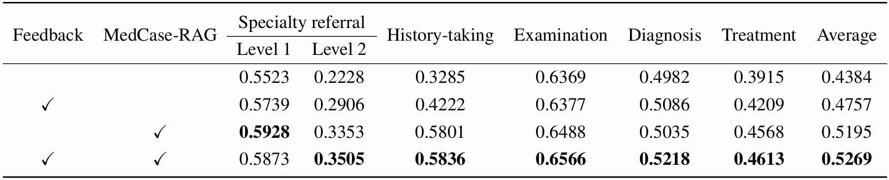

# MedChain

This repository provides the official implementation of MedChain.


<b>MedChain: Bridging the Gap Between LLM Agents and Clinical Practice with Interactive Sequence</b> <br/>
[Jie Liu](https://scholar.google.com/citations?hl=zh-CN&user=k05bkIEAAAAJ)<sup>1*</sup>, [Wenxuan Wang](https://scholar.google.com/citations?user=4v5x0bUAAAAJ&hl=en)<sup>2*</sup>, Zizhan Ma<sup>2</sup>, Guolin Huang<sup>3</sup>, SU Yihang<sup>2</sup>, <br/> [Kao-Jung Chang](https://scholar.google.com/citations?user=ywIXJmEAAAAJ&hl=zh-TW)<sup>4,5</sup>, [Wenting Chen](https://scholar.google.com/citations?user=3dtKW_8AAAAJ&hl=zh-CN)<sup>1</sup>, [Haoliang Li](https://scholar.google.com/citations?user=1xioat8AAAAJ&hl=zh-CN)<sup>1</sup>, [Linlin Shen](https://scholar.google.com.hk/citations?user=AZ_y9HgAAAAJ&hl=zh-CN)<sup>3</sup>, [Michael Lyu](https://scholar.google.com/citations?user=uQnBgK0AAAAJ&hl=en)<sup>2</sup>

<sup>1</sup>City University of Hong Kong, <sup>2</sup>The Chinese University of Hong Kong, <sup>3</sup>Shenzhen University, <br/>  <sup>4</sup>National Yang Ming Chiao Tung University, <sup>5</sup>Taipei Veterans General Hospital


[paper](https://arxiv.org/abs/2412.01605) | [code](https://github.com/ljwztc/MedChain) | [dataset](https://huggingface.co/datasets/ljwztc/MedChain)

## 🚀Overview

In this paper, we introduce **MedChain**, a novel benchmark designed to bridge the gap between Large Language Model (LLM) agents and real-world clinical decision-making (CDM).  Unlike existing medical benchmarks that focus on isolated tasks, MedChain emphasizes three core features of clinical practice: **personalization**, **interactivity**, and **sequentiality**.

**MedChain** comprises **12,163** rigorously validated clinical cases spanning **19 medical specialties** and **156 sub-categories**, including **7,338 medical images** with reports.  Each case progresses through five sequential stages:
1️⃣ **Specialty Referral**
2️⃣ **History-taking**
3️⃣ **Examination**
4️⃣ **Diagnosis**
5️⃣ **Treatment**

To address the challenges of MedChain, the authors propose **MedChain-Agent**, a multi-agent framework integrating:
- **Three specialized agents** (General, Summarizing, Feedback) for collaborative decision-making.
- **MedCase-RAG**, a retrieval-augmented module that dynamically expands a structured medical case database (12D feature vectors) for context-aware reasoning.

**Key Results**:

- MedChain-Agent outperforms state-of-the-art models (e.g., GPT-4o, Claude-3.5) with an **average score of 0.5269** across tasks, showcasing superior adaptability in sequential CDM.
- Ablation studies confirm the critical roles of **feedback mechanisms** and **MedCase-RAG** .
- The benchmark exposes limitations in existing LLMs, with single-agent models scoring ≤0.4327 due to error propagation in sequential stages.

**MedChain** sets a new standard for evaluating AI in clinical workflows, highlighting the need for frameworks that mirror real-world complexity while enabling reliable, patient-centric decision-making.  The dataset and code will be released publicly to foster progress in medical AI.


## 📦Code

1. You can find the workflow code for the five core tasks of MedChain in the `task_framework`, and they can be individually tested.   

   ```python
   cd task_framework
   Specialty Referral：  python task1_triage.py
   History-taking：      python task2_interrogation.py
   Examination：         python task3_image.py
   Diagnosis：           python task4_diagnosis.py
   Treatment：           python task5_treatment.py
   ```
The "doctor_patient_interaction" file presents a detailed process of doctor-patient interaction. By inputting the correct LLM API interface and running the wenzhen_main.py script, you can achieve this. The remaining scripts are for extracting specified information and calculating the IoU value.
3. You can locate the core workflow code for **MedChain-Agent**, **MedCase-RAG**, and the feedback mechanism in the `main.py` file, and run tests to evaluate MedChain-Agent.

   ```python
   python main.py
   ```

3. Below are the comparative and ablation study results for MedChain-Agent.




For More Details, please see our paper.

## 🔍 Insights
1. **Sequential clinical decision-making exposes critical gaps in current AI systems**, with single-agent models achieving only 43.27% average accuracy (Claude-3.5), while MedChain-Agent improves performance to 52.69% through multi-agent collaboration and error mitigation.  
2. **Structured medical knowledge retrieval (MedCase-RAG) drives significant performance gains**, contributing a **8.11% improvement** in clinical task accuracy by enabling dynamic case matching through 12-dimensional feature vectors.  
3. **Iterative feedback mechanisms are pivotal for clinical reasoning**, reducing error propagation and boosting average scores by **3.73%** through continuous refinement across sequential stages.  

## 🎈Acknowledgements
Weare particularly indebted to the administrators of the iiyi website for their generosity in allowing us to utilize their data for our research purposes. We would like to acknowledge the assistance provided by Claude-3.5 in proofreading our manuscript for grammatical accuracy and in facilitating the creation of LaTeX tables.
## 📜Citation
If you find our work helpful for your research, please consider giving a star ⭐ and citation 📝
```bibtex
@misc{liu2024medchainbridginggapllm,
      title={MedChain: Bridging the Gap Between LLM Agents and Clinical Practice with Interactive Sequence}, 
      author={Jie Liu and Wenxuan Wang and Zizhan Ma and Guolin Huang and Yihang SU and Kao-Jung Chang and Wenting Chen and Haoliang Li and Linlin Shen and Michael Lyu},
      year={2024},
      eprint={2412.01605},
      archivePrefix={arXiv},
      primaryClass={cs.CL},
      url={https://arxiv.org/abs/2412.01605}, 
}
```
